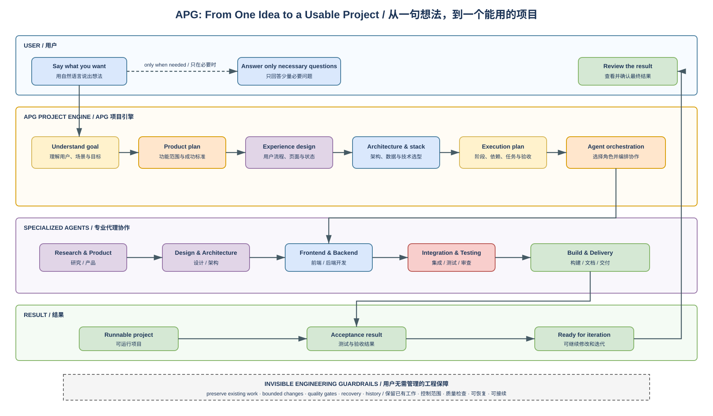

# APG：把一句想法，变成一个能用的项目

**你负责说想做什么，APG 负责把它规划、设计、编排、开发、验证并交付。**

不懂产品设计、不懂技术栈、不懂如何组织 AI 代理，也可以从一句自然语言开始：

> 我想做一个帮助小商家自动生成短视频、管理素材并发布内容的工具。

APG 会把这句话逐步变成清晰的产品方案、专业的体验设计、合适的技术架构、可执行的任务计划和经过验证的项目结果。

[中文介绍](#中文介绍) | [English](#english)



## 中文介绍

### 一句话定位

Adaptive Project Governance（APG）是一套面向普通用户和 AI 编程代理的**项目规划与落地系统**。

它把成熟产品团队的工作方式装进一个可复用流程：理解想法、补全需求、设计产品、选择技术、拆解任务、编排代理、开发测试、交付结果。用户不需要先学会编程、框架、架构、项目管理或质量治理。

### 用户只需要做什么

1. **说出想法**：用日常语言描述想做的网站、应用、游戏、AI 工具、自动化、数据项目或其他产品。
2. **回答少量必要问题**：例如给谁用、最重要的功能是什么、是否有预算或时间限制。能由系统判断的问题不会反复问用户。
3. **确认关键方向和结果**：查看可理解的方案或成品，提出修改意见。

其余工作由 APG 组织完成。

### APG 在后台完成什么

#### 1. 把模糊想法变成清晰目标

APG 会识别目标用户、使用场景、核心价值、成功标准和现实约束。信息不足时，它只追问真正影响方向的问题，并给出推荐答案，让没有产品经验的用户也能快速作决定。

#### 2. 按成熟团队方式设计产品

系统会整理功能范围、用户流程、页面结构、数据关系、权限、异常状态和验收标准。对于前端产品，它会考虑交互效率、视觉层级、响应式布局和完整的加载、空状态、错误状态，而不是只做一个能截图的界面。

#### 3. 自动选择合适的技术方案

用户不需要决定 React、Vue、Python、数据库、云服务或模型框架。APG 会根据项目类型、规模、成本、维护难度、性能和现有环境选择适合的技术栈，并解释真正需要用户决定的取舍。

#### 4. 把方案拆成可执行工程计划

系统会明确阶段、依赖、模块边界、接口、测试、验收条件和交付顺序。复杂项目可以拆给多个专业代理并行工作，同时避免大家修改同一处、重复劳动或互相覆盖。

#### 5. 编排 AI 代理完成落地

APG 可以协调研究、产品、设计、架构、前端、后端、测试、审查和发布等角色。它会根据任务复杂度决定是由一个代理完成，还是组成小型协作团队，并持续把工作对齐到最初目标。

#### 6. 交付能运行、能验收、能继续迭代的结果

交付不只是几段代码。APG 会组织必要的测试、构建、说明文档、运行方式和验收结果，使项目可以被打开、使用、检查和继续开发。

### 能做哪些项目

- 网站、管理后台、企业工具和 SaaS 产品
- 移动应用、桌面应用、小程序和浏览器扩展
- AI 助手、知识库、智能工作流和模型应用
- 数据分析、报表、仪表盘和自动化处理系统
- 游戏、互动体验、内容生产和创意工具
- API、后端服务、脚本、机器人和内部自动化
- 已有项目的功能升级、重构、修复和持续迭代

APG 不限定某一种编程语言或框架。它先理解要解决的问题，再选择实现方式。

### 一个想法如何变成结果

```text
用户说出想法
  → APG 理解目标并补全必要信息
  → 形成产品方案和用户体验设计
  → 选择架构、技术栈和交付方式
  → 拆解任务并编排专业代理
  → 开发、集成、测试和审查
  → 交付可运行项目与验收结果
  → 根据反馈继续迭代
```

可编辑工程图见 [APG idea-to-result workflow](docs/diagrams/apg-governance-workflow.drawio)。

### 为什么它不会只是“让 AI 随便写代码”

用户不需要理解治理术语，但系统需要在后台保证工程质量。APG 会默默维护以下能力：

- **范围清楚**：只修改当前任务需要的内容，保留用户已有工作。
- **设计先行**：先理解目标和影响，再进入实现。
- **质量检查**：根据项目风险运行合适的测试、构建和验证。
- **过程可恢复**：重要操作保留恢复边界，失败时不会随意破坏项目。
- **状态不混淆**：本地完成、安装、运行、公开发布和真实项目验收分别确认。
- **长期可继续**：保留足够的项目上下文，让后续代理能够接着做，而不是每次重新猜。

这些机制服务于一个简单结果：**用户只需要关注想法和成品，不需要管理中间的工程混乱。**

### 与 Codex、Claude、Cursor、Grok 等工具的关系

APG 不是新的大模型，也不替代编程代理。它是这些代理上层的项目工作系统：为它们提供统一的目标、规划、任务边界、协作方式和质量标准。

同一个 APG 项目可以根据本机环境接入 Codex、Claude Code、Cursor 或共享技能路由。每个客户端是否已经发现并加载 APG，需要在对应环境中分别验证。

### 怎么开始

最简单的用法不是先写配置，而是直接描述目标：

```text
我想做一个面向健身教练的会员管理系统，能记录课程、生成训练计划、提醒续费。
我不懂技术，请你用 APG 帮我从产品规划开始，一直做到可以运行和验收。
```

也可以把现有项目交给 APG：

```text
这是我现有的项目。请先理解它，不要破坏已有内容，然后帮我增加团队协作和数据报表功能。
```

### 给工程人员的控制接口

APG 同时保留可审计的控制器接口。下面这些命令用于项目诊断、接入、变更规划和质量检查；普通用户不需要手动执行它们。

```powershell
$apg = 'C:\Users\Administrator\.codex\skills\adaptive-project-governance\scripts\project_governance.py'
python -B -X utf8 $apg doctor . --json
python -B -X utf8 $apg audit . --json
python -B -X utf8 $apg plan-change . --request .\change-request.json --json
python -B -X utf8 $apg check . --phase full --json
```

### 当前公开版本

`v0.3.0` 是当前已接受的 APG 核心包。`MANIFEST.json` 定义规范文件集合并支持独立哈希验证。对 `main` 分支的介绍和工程图更新不会重写不可变的 `v0.3.0` 标签。

公开包完成不自动等于所有客户端运行时、外部 provider 或下游项目试点已经完成；这些状态会在实际使用环境中分别验证。

查看 [操作指南](docs/README.md) 和 [技能契约](SKILL.md)。

---

## English

### From One Idea to a Working Project

Adaptive Project Governance (APG) is a **project planning and delivery system for people and AI coding agents**.

You describe what you want in ordinary language. APG organizes the work required to turn it into a usable project: requirements, product design, user experience, architecture, technology selection, task planning, agent orchestration, implementation, testing, and delivery.

You do not need to choose a framework, design a database, manage an agent team, or understand project governance before you begin.

> I want a tool that helps small businesses generate short videos, manage their media, and publish content.

APG turns that sentence into a clear product plan and an executable engineering process.

### What the User Does

1. **Describe the idea** in natural language.
2. **Answer a small number of necessary questions** about users, priorities, budget, or constraints. APG resolves questions it can answer itself.
3. **Confirm key directions and review the result.**

APG organizes the rest.

### What APG Handles

#### Understand the Goal

APG identifies the target users, real-world scenarios, core value, success criteria, and constraints. When information is missing, it asks only decisions that materially affect the outcome and provides a recommended answer.

#### Design the Product Professionally

It defines the feature scope, user journeys, screens, states, data relationships, permissions, failure behavior, and acceptance criteria. User-facing products include responsive behavior and complete loading, empty, success, and error states rather than a screenshot-only interface.

#### Select the Technology

The user does not need to choose React, Vue, Python, a database, a cloud platform, or an AI framework. APG evaluates the project type, scale, cost, maintainability, performance, and existing environment, then selects an appropriate stack and surfaces only meaningful tradeoffs.

#### Build an Executable Plan

APG breaks the solution into phases, dependencies, modules, interfaces, tests, acceptance conditions, and delivery order. Complex work can be assigned to specialized agents in parallel without overlapping ownership or duplicated effort.

#### Orchestrate AI Agents

APG can coordinate research, product, design, architecture, frontend, backend, testing, review, and release roles. It decides whether a task needs one agent or a small collaborating team and keeps every role aligned with the original goal.

#### Deliver a Usable Result

Delivery is more than generated code. APG organizes the build, tests, documentation, runtime instructions, and acceptance evidence so the project can be opened, used, reviewed, and extended.

### Projects APG Can Organize

- Websites, dashboards, operational tools, and SaaS products
- Mobile, desktop, mini-app, and browser-extension projects
- AI assistants, knowledge systems, workflows, and model-powered applications
- Data analysis, reports, dashboards, and automation systems
- Games, interactive experiences, content-production and creative tools
- APIs, backend services, scripts, bots, and internal automation
- Features, repairs, refactors, and continued development of existing projects

APG is not tied to one language or framework. It starts with the problem and selects an implementation that fits.

### Idea-to-Result Workflow

```text
Describe an idea
  → understand the goal and resolve necessary unknowns
  → create the product and experience design
  → select architecture, technology, and delivery strategy
  → decompose work and orchestrate specialized agents
  → implement, integrate, test, and review
  → deliver a runnable project and acceptance result
  → continue iterating from feedback
```

See the editable [APG idea-to-result workflow](docs/diagrams/apg-governance-workflow.drawio).

### The Engineering Discipline Stays in the Background

Users should not have to manage governance terminology. APG quietly keeps changes bounded, validates work at the appropriate level, preserves existing project state, retains recovery paths for important operations, and keeps installation, runtime, publication, and real-world acceptance as separate facts.

The purpose is simple: **the user focuses on the idea and the outcome while APG manages the engineering complexity in between.**

### Working with Codex, Claude, Cursor, and Grok

APG is not a new foundation model and does not replace coding agents. It is the project operating layer above them, providing shared goals, plans, ownership boundaries, collaboration rules, and quality standards.

An APG project can connect to Codex, Claude Code, Cursor, or shared-skill routing according to the local environment. Discovery and runtime activation must still be verified separately for each host.

### Start with Natural Language

```text
I want a membership system for fitness coaches that tracks sessions,
generates training plans, and reminds clients to renew.
I am not technical. Use APG to take it from product planning to a runnable result.
```

For an existing project:

```text
Understand this project first and preserve its existing work.
Then add team collaboration and analytics reporting.
```

### Engineering Interface

APG also exposes auditable controller commands for diagnostics, adoption, change planning, and quality checks. Non-technical users do not need to run these manually.

```powershell
$apg = 'C:\Users\Administrator\.codex\skills\adaptive-project-governance\scripts\project_governance.py'
python -B -X utf8 $apg doctor . --json
python -B -X utf8 $apg audit . --json
python -B -X utf8 $apg plan-change . --request .\change-request.json --json
python -B -X utf8 $apg check . --phase full --json
```

### Current Public Version

`v0.4.0-dev.20260813` is the APG `main` development snapshot. Its core package
contains the repository-validated P3-A through P3-J capabilities and aligned
`RPD.md`; `MANIFEST.json` defines the canonical core file set for independent
hash verification. The immutable `v0.3.0` tag remains unchanged, and this
snapshot does not create a tag or GitHub Release.

A public package does not automatically prove host integration, runtime
activation in every client, external-provider acceptance, target-project
execution, deployment, promotion, pilot, or formal release acceptance. Those
stages are verified in their actual environments and remain outside this
snapshot.

See the [operator guide](docs/README.md) and [skill contract](SKILL.md).
